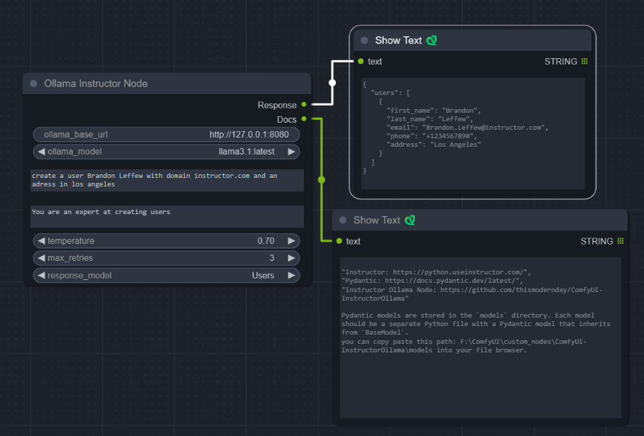

# ComfyUI Instructor Ollama

Custom [ComfyUI](https://github.com/comfyanonymous/ComfyUI) Nodes for interacting with [Ollama](https://ollama.com/) using the [Instructor](https://github.com/jxnl/instructor). Library to provide structured output from your LLM

To use this properly, you would need a running Ollama server reachable from the host that is running ComfyUI.


## Installation

1. git clone into the ```custom_nodes``` folder inside your ComfyUI installation or download as zip and unzip the contents to ```custom_nodes/ComfyUI-InstructorOllama```.
2. `pip install -r requirements.txt`
3. Start/restart ComfyUI


## Nodes

Ollama Instructor Node



This is currently the only node in this pack. More will be added in the future

**Response models**
--
These are the pydantic models they are found in your custom nodes folder under 

`ComfyUI-InstructorOllama/models`

I have included 4 examples in the models folder.

The way the node currently works it looks for the python file in the folder (this allows you to create new models refresh the page to hotload the new models in)

### Example Pydantic Model
```Python
from pydantic import BaseModel, Field

class User(BaseModel):
    first_name: str
    last_name: str
    email: str
    phone: str
    address: str

class Users(BaseModel):
    users: List[User]
```

The file name must match the class of the pydantic model you are wanting to use so in the example above the file in the models folder is called `Users.py`

I strongly suggest reading up on pydantic models before starting with this node.
